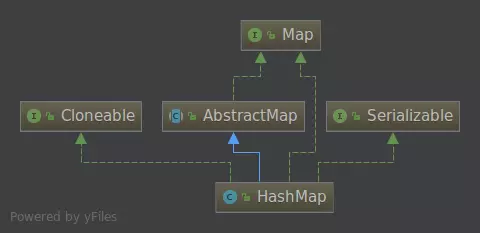
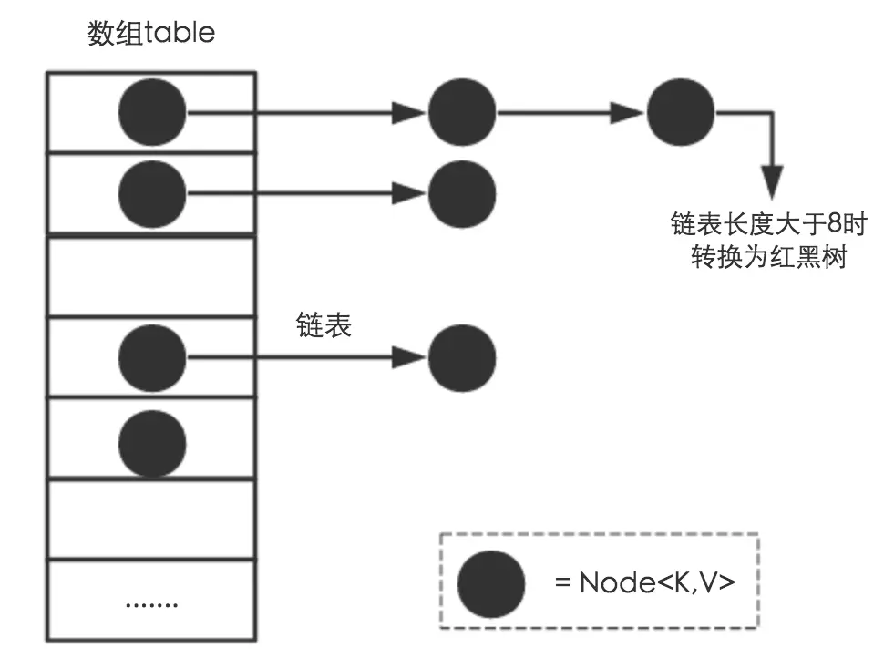

# HashMap原码分析（基于JDK1.8）

> HashMap是Java程序员使用频率最高的数据结构之一。另外，JDK1.8对HashMap底层的实现进行了优化，如引入红黑树的数据结构以及扩容的优化等等来提高性能。本文结合JDK1.8的源码，探讨HashMap的结构实现和功能原理。

## HashMap的UML图


## HashMap的成员变量及其含义

```java
public class HashMap<K,V> extends AbstractMap<K,V>
    implements Map<K,V>, Cloneable, Serializable {

    private static final long serialVersionUID = 362498820763181265L;

    /**
     * HashMap的默认初始化大小为16
     */
    static final int DEFAULT_INITIAL_CAPACITY = 1 << 4; // aka 16

    /**
     * HashMap的最大容量。
     */
    static final int MAXIMUM_CAPACITY = 1 << 30;

    /**
     * 负载因子的大小，一般HashMap的扩容的临界点是当前HashMap的大小 > DEFAULT_LOAD_FACTOR * DEFAULT_INITIAL_CAPACITY 
     */
    static final float DEFAULT_LOAD_FACTOR = 0.75f;

    /**
     * 这是JDK1.8在底层做的一个优化，当一个Entry挂载的节点超过8个，就会将当前Entry的链表结构转化为红黑树的数据结构
     */
    static final int TREEIFY_THRESHOLD = 8;

    /**
     * 
     */
    static final int UNTREEIFY_THRESHOLD = 6;

    /**
     * 红黑树的最大节点数
     */
    static final int MIN_TREEIFY_CAPACITY = 64;

    /**
     * 是hash表中，Entry的节点.
     */
    static class Node<K,V> implements Map.Entry<K,V> {
        final int hash;
        final K key;
        V value;
        Node<K,V> next;

        Node(int hash, K key, V value, Node<K,V> next) {
            this.hash = hash;
            this.key = key;
            this.value = value;
            this.next = next;
        }

        public final K getKey()        { return key; }
        public final V getValue()      { return value; }
        public final String toString() { return key + "=" + value; }

        public final int hashCode() {
            return Objects.hashCode(key) ^ Objects.hashCode(value);
        }

        public final V setValue(V newValue) {
            V oldValue = value;
            value = newValue;
            return oldValue;
        }

        public final boolean equals(Object o) {
            if (o == this)
                return true;
            if (o instanceof Map.Entry) {
                Map.Entry<?,?> e = (Map.Entry<?,?>)o;
                if (Objects.equals(key, e.getKey()) &&
                    Objects.equals(value, e.getValue()))
                    return true;
            }
            return false;
        }
    }// end of Entrty
    
     /* ---------------- Static utilities -------------- */
    
        /**
         * 计算key的hash值。
         */
        static final int hash(Object key) {
            int h;
            return (key == null) ? 0 : (h = key.hashCode()) ^ (h >>> 16);
        }
        
        /**
         * 这个方法时HashMap中比较实用的方法，用于计算传入值的2倍，也算是JDK源码部分的最佳实践。
         */
        static final int tableSizeFor(int cap) {
            int n = cap - 1;
            n |= n >>> 1;
            n |= n >>> 2;
            n |= n >>> 4;
            n |= n >>> 8;
            n |= n >>> 16;
            return (n < 0) ? 1 : (n >= MAXIMUM_CAPACITY) ? MAXIMUM_CAPACITY : n + 1;
        }
    
        /* ---------------- Fields -------------- */
    
        /**
         * hash表 哈希桶
         */
        transient Node<K,V>[] table;
    
        /**
         * 保存缓存的entrySet。
         */
        transient Set<Map.Entry<K,V>> entrySet;
    
        /**
         * map中键值对的数量。
         */
        transient int size;
    
        /**
         * 
         * 这个HashMap被结构修改的次数结构修改是那些改变HashMap中的映射数量或者修改其内部结构（例如，重新散列）的修改。 该字段用于在HashMap失败快速的Collection-views上创建迭代器。
         */
        transient int modCount;
    
        /**
         * The next size value at which to resize (capacity * load factor).
         *
         * @serial
         */
        int threshold;
    
        /**
         * The load factor for the hash table.
         *
         * @serial
         */
        final float loadFactor;
}
```

## HashMap的主要方法实现

### 内部实现

搞清楚HashMap，首先需要知道HashMap是什么，即它的存储结构-字段；其次弄明白它能干什么，即它的功能实现-方法。下面我们针对这两个方面详细展开讲解。

### 存储结构-字段

从结构实现来讲，HashMap是数组+链表+红黑树（JDK1.8增加了红黑树部分）实现的，如下图所示。



1. 从源码可知，HashMap类中有一个非常重要的字段，就是 Node[] table，即哈希桶数组，明显它是一个Node的数组。我们来看Node[JDK1.8]是何物。

```java
static class Node<K,V> implements Map.Entry<K,V> {
        final int hash;    //用来定位数组索引位置
        final K key;
        V value;
        Node<K,V> next;   //链表的下一个node

        Node(int hash, K key, V value, Node<K,V> next) { ... }
        public final K getKey(){ ... }
        public final V getValue() { ... }
        public final String toString() { ... }
        public final int hashCode() { ... }
        public final V setValue(V newValue) { ... }
        public final boolean equals(Object o) { ... }
}
```

Node是HashMap的一个内部类，实现了Map.Entry接口，本质是就是一个映射(键值对)。上图中的每个黑色圆点就是一个Node对象。

2.  HashMap就是使用哈希表来存储的。哈希表为解决冲突，可以采用开放地址法和链地址法等来解决问题，Java中HashMap采用了链地址法。链地址法，简单来说，就是数组加链表的结合。在每个数组元素上都一个链表结构，当数据被Hash后，得到数组下标，把数据放在对应下标元素的链表上。例如程序执行下面代码：

```java
map.put("name","makefeixiang");
```

系统将调用”name”这个key的hashCode()方法得到其hashCode 值（该方法适用于每个Java对象），然后再通过Hash算法的后两步运算来定位该键值对的存储位置，有时两个key会定位到相同的位置，表示发生了Hash碰撞。当然Hash算法计算结果越分散均匀，Hash碰撞的概率就越小，map的存取效率就会越高。

```java
/**
  * 计算key的hash值。
  */
 static final int hash(Object key) {
     int h;
     return (key == null) ? 0 : (h = key.hashCode()) ^ (h >>> 16);
 }
```

当然如果哈希桶数组很大，即便是较差的hash算法也会比较分散，有较好的效果，然而，如果哈希桶数组数组很小，即使好的Hash算法也会出现较多hash碰撞，因此就需要在空间成本和时间成本之间权衡，其实就是在根据实际情况确定哈希桶数组的大小，并在此基础上设计好的hash算法减少Hash碰撞。那么通过什么方式来控制map使得Hash碰撞的概率又小，哈希桶数组（Node[] table）占用空间又少呢？答案就是好的Hash算法和扩容机制。
HashMap的扩容机制就是通过threshold = length * Load factor来做是否进行扩容的决策。也就是说，在数组定义好长度之后，负载因子越大，所能容纳的键值对个数越多。当然，负载因子也不是越大越好，JDK设计者给出了一个相对来说比较均衡的方案，Load factor为负载因子(默认值是0.75)，一般我们不对这个参数做修改。

### 功能实现-方法

HashMap的内部功能实现很多，本文主要选取从根据key获取HashMap数组索引、put方法的执行、扩容、获取HashMap对应key的值等几个具有代表性的点深入展开讲解。

1. 确定哈希桶数组索引位置

不管增加、删除、查找键值对，定位到哈希桶数组的索引都是很关键的第一步。HashMap的数据结构是数组和链表或者红黑树的结合，所以我们希望这个HashMap里面的元素位置尽量分布均匀，使得每个位置上的元素数量只有一个，那么当我们用hash算法求得这个位置的时候，就可以马上找到，不用遍历链表，查询的时间复杂度也仅仅是O(n)。我们来看看源码的实现：

```java
// 方法1，代码段1
static final int hash(Object key) {
   int h;
   return (key == null) ? 0 : (h = key.hashCode()) ^ (h >>> 16);
}

// 当我们使用hash时，代码段2
if ((p = tab[i = (n - 1) & hash]) == null)
	     tab[i] = newNode(hash, key, value, null);
```

这里的Hash算法本质上就是三步：取key的hashCode值、高位运算、取模运算。

2. 分析HashMap的put方法

①.判断键值对数组table[i]是否为空或为null，否则执行resize()进行扩容；
②.根据键值key计算hash值得到插入的数组索引i，如果table[i]==null，直接新建节点添加，转向⑥，如果table[i]不为空，转向③；
③.判断table[i]的首个元素是否和key一样，如果相同直接覆盖value，否则转向④，这里的相同指的是hashCode以及equals；
④.判断table[i] 是否为treeNode，即table[i] 是否是红黑树，如果是红黑树，则直接在树中插入键值对，否则转向⑤；
⑤.遍历table[i]，判断链表长度是否大于8，大于8的话把链表转换为红黑树，在红黑树中执行插入操作，否则进行链表的插入操作；遍历过程中若发现key已经存在直接覆盖value即可；
⑥.插入成功后，判断实际存在的键值对数量size是否超多了最大容量threshold，如果超过，进行扩容。

```java
final V putVal(int hash, K key, V value, boolean onlyIfAbsent,
               boolean evict) {
    Node<K,V>[] tab; Node<K,V> p; int n, i;
    // 步骤①：tab为空则创建
    if ((tab = table) == null || (n = tab.length) == 0)
        n = (tab = resize()).length;
    // 步骤②：计算index，并对null做处理 
    if ((p = tab[i = (n - 1) & hash]) == null)
        tab[i] = newNode(hash, key, value, null);
    else {
        Node<K,V> e; K k;
        // 步骤③：节点key存在，直接覆盖value
        if (p.hash == hash &&
            ((k = p.key) == key || (key != null && key.equals(k))))
            e = p;
        // 步骤④：判断该链为红黑树
        else if (p instanceof TreeNode)
            e = ((TreeNode<K,V>)p).putTreeVal(this, tab, hash, key, value);
        // 步骤⑤：该链为链表
        else {
            for (int binCount = 0; ; ++binCount) {
                if ((e = p.next) == null) {
                    p.next = newNode(hash, key, value, null);
                    //链表长度大于8转换为红黑树进行处理
                    if (binCount >= TREEIFY_THRESHOLD - 1) // -1 for 1st
                        treeifyBin(tab, hash);
                    break;
                }
                // key已经存在直接覆盖value
                if (e.hash == hash &&
                    ((k = e.key) == key || (key != null && key.equals(k))))
                    break;
                p = e;
            }
        }
        if (e != null) { // existing mapping for key
            V oldValue = e.value;
            if (!onlyIfAbsent || oldValue == null)
                e.value = value;
            afterNodeAccess(e);
            return oldValue;
        }
    }
    ++modCount; // 用来实现迭代时被修改的快速失败策略
    // 步骤⑥：超过最大容量 就扩容
    if (++size > threshold)
        resize();
    afterNodeInsertion(evict);
    return null;
}
```

3. 扩容机制的实现

扩容(resize)就是重新计算容量，向HashMap对象里不停的添加元素，当HashMap对象内部的数组长度 大于DEFAULT_LOAD_FACTOR * DEFAULT_INITIAL_CAPACITY ，HashMap就需要扩大数组的长度，以便能装入更多的元素。方法是使用一个新的数组代替已有的容量小的数组。

我们分析下resize的源码，鉴于JDK1.8融入了红黑树，较复杂，为了便于理解我们仍然使用JDK1.7的代码，好理解一些，本质上区别不大，具体区别后文再说。

```java
final Node<K,V>[] resize() {
    Node<K,V>[] oldTab = table;
    int oldCap = (oldTab == null) ? 0 : oldTab.length;
    int oldThr = threshold;
    int newCap, newThr = 0;
    if (oldCap > 0) {
        // 超过最大值就不再扩充了
        if (oldCap >= MAXIMUM_CAPACITY) {
            threshold = Integer.MAX_VALUE;
            return oldTab;
        }
        // 没超过最大值，就扩充为原来的2倍
        else if ((newCap = oldCap << 1) < MAXIMUM_CAPACITY &&
                 oldCap >= DEFAULT_INITIAL_CAPACITY)
            newThr = oldThr << 1; // double threshold
    }
    else if (oldThr > 0) // initial capacity was placed in threshold
        newCap = oldThr;
    else {               // zero initial threshold signifies using defaults
        newCap = DEFAULT_INITIAL_CAPACITY;
        newThr = (int)(DEFAULT_LOAD_FACTOR * DEFAULT_INITIAL_CAPACITY);
    }
    // 计算新的resize上限
    if (newThr == 0) {
        float ft = (float)newCap * loadFactor;
        newThr = (newCap < MAXIMUM_CAPACITY && ft < (float)MAXIMUM_CAPACITY ?
                  (int)ft : Integer.MAX_VALUE);
    }
    threshold = newThr;
    @SuppressWarnings({"rawtypes","unchecked"})
        Node<K,V>[] newTab = (Node<K,V>[])new Node[newCap];
    table = newTab;
    if (oldTab != null) {
        // 把每个bucket都移动到新的buckets中
        for (int j = 0; j < oldCap; ++j) {
            Node<K,V> e;
            if ((e = oldTab[j]) != null) {
                oldTab[j] = null;
                if (e.next == null)
                    newTab[e.hash & (newCap - 1)] = e;
                // 
                else if (e instanceof TreeNode)
                    ((TreeNode<K,V>)e).split(this, newTab, j, oldCap);
                else { // 链表优化重hash的代码块
                    Node<K,V> loHead = null, loTail = null;
                    Node<K,V> hiHead = null, hiTail = null;
                    Node<K,V> next;
                    do {
                        next = e.next;
                        // 原索引
                        if ((e.hash & oldCap) == 0) {
                            if (loTail == null)
                                loHead = e;
                            else
                                loTail.next = e;
                            loTail = e;
                        }
                        // 原索引+oldCap
                        else {
                            if (hiTail == null)
                                hiHead = e;
                            else
                                hiTail.next = e;
                            hiTail = e;
                        }
                    } while ((e = next) != null);
                    // 原索引放到bucket里
                    if (loTail != null) {
                        loTail.next = null;
                        newTab[j] = loHead;
                    }
                    // 原索引+oldCap放到bucket里
                    if (hiTail != null) {
                        hiTail.next = null;
                        newTab[j + oldCap] = hiHead;
                    }
                }
            }
        }
    }
    return newTab;
}
```

4. HashMap中根据key获取value代码实现

相比于上面几个，HashMap中获取value相对来说就简单许多，基本逻辑就是根据key算出hash值定位到哈希桶的索引，当可以就是当前索引的值则直接返回其对于的value，反之用key去遍历equal该索引下的key，直到找到位置。

```java
final Node<K,V> getNode(int hash, Object key) {
    Node<K,V>[] tab; Node<K,V> first, e; int n; K k;
    if ((tab = table) != null && (n = tab.length) > 0 &&
        (first = tab[(n - 1) & hash]) != null) {
        if (first.hash == hash && // always check first node
            ((k = first.key) == key || (key != null && key.equals(k))))
            return first;
        if ((e = first.next) != null) {
            if (first instanceof TreeNode)
                return ((TreeNode<K,V>)first).getTreeNode(hash, key);
            do {
                if (e.hash == hash &&
                    ((k = e.key) == key || (key != null && key.equals(k))))
                    return e;
            } while ((e = e.next) != null);
        }
    }
    return null;
}

```

## HashMap的线程安全问题

在多线程使用场景中，应该尽量不要使用线程不安全的HashMap，而应该使用线程安全的ConcurrentHashMap。那么HashMap线程不安全的性质表现在哪里呢？下面来分析一下并发场景下使用HashMap可能造成死循环的问题。在HashMap的resize方法中，我们可以看到

```java
Node<K,V> loHead = null, loTail = null;
   Node<K,V> hiHead = null, hiTail = null;
   Node<K,V> next;
   do {
       next = e.next;
       if ((e.hash & oldCap) == 0) {
           if (loTail == null)
               loHead = e;
           else
               loTail.next = e;
           loTail = e;
       }
       else {
           if (hiTail == null)
               hiHead = e;
           else
               hiTail.next = e;
           hiTail = e;
       }
   } while ((e = next) != null);
```

## 小结

1. 扩容是一个特别耗性能的操作，因此初始化HashMap的时候给一个数值，避免map频繁的扩容情况的额发生。

2. 负载因子是可以修改的，但是建议一般情况下不要轻易修改。

3. HashMap是线程不安全的，不要在并发的环境中使用HashMap，建议使用ConcurrentHashMap或者Collections.synchronizedMap()中的。

4. JDK1.8引入红黑树在很大程度优化了HashMap的性能